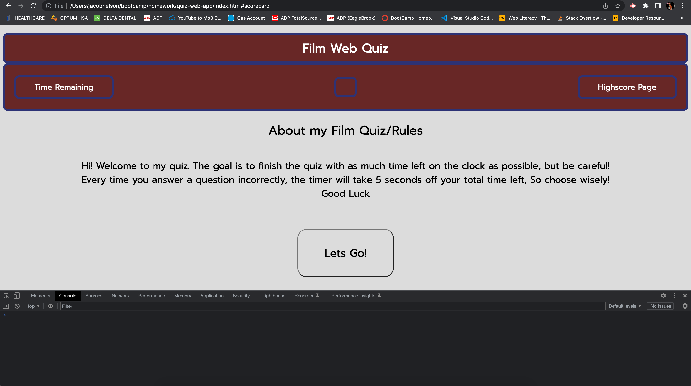

# Web App: JS-Powered-Quiz

* Our homework assignment for this week was to create a web quiz with minimal html, and to use JavaScript to dynamically build out questions, answers, a working timer that decrements off of incorrect guesses, and validate those guesses for correctness. The javascript is also dynamically populating a highscore page and using local storage and JSON to store and display highscore and name pairs for score tracking! 

## Links

*[Here's a link to the live site!]()
